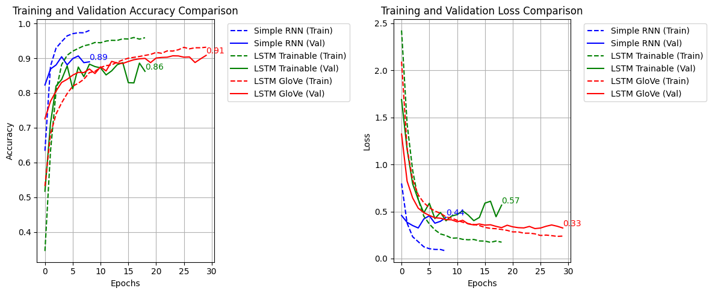
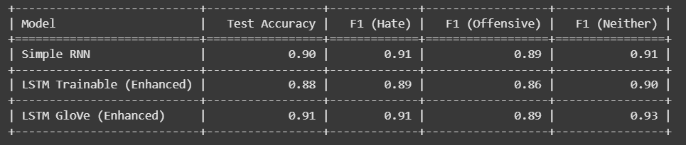

# Tweet Sentiment Classifier for Hate Speech Detection 🚀

Welcome to the **TweetClassifier** project! This repository showcases a deep learning-based solution to classify tweets into **Hate Speech**, **Offensive Language**, or **Neither**, aimed at supporting social media platforms in automating toxic content detection for early moderation. Developed using Python, Keras, and advanced NLP techniques, this project dives into two robust models—**Simple RNN** and **Enhanced LSTM with GloVe**—with comprehensive analysis of their performance and training dynamics.

---

## 📖 Project Overview

Social media platforms are inundated with toxic content, posing a challenge for effective moderation. This project addresses that by leveraging natural language processing (NLP) and deep learning to classify tweets accurately. Inspired by real-world needs, I explored two model architectures, balanced an imbalanced dataset, and evaluated results with detailed metrics and visualizations. This work reflects a blend of technical rigor and practical application, making it a valuable case study in hate speech detection.

### Key Objectives
- Develop models to distinguish between hate speech, offensive language, and neutral content.
- Address class imbalance to ensure fair and unbiased predictions.
- Provide transparent analysis through visualizations and performance metrics.

### Key Features
- **Dual Models**: Simple RNN and Enhanced LSTM with GloVe embeddings.
- **Data Balancing**: Innovative use of downsampling and SMOTE with cosine similarity.
- **Detailed Evaluation**: In-depth analysis with accuracy, F1-scores, and training curves.

---

## 📊 Models and Results

This project features two deep learning models, trained and evaluated on the `hatevsoffensive_language.csv` dataset. Performance was assessed using `confusion_matrix`, `accuracy_score`, and `classification_report`.

### Simple RNN
- **Architecture**: A single recurrent layer with EarlyStopping to mitigate overfitting, implemented in Keras.
- **Test Accuracy**: 90%
- **F1-Scores**:
  - Hate: 0.91
  - Offensive: 0.89
  - Neither: 0.91
- **Insight**: Served as a baseline, showing strong performance with a simpler structure.

### Enhanced LSTM with GloVe
- **Architecture**: Multi-layer LSTM with GloVe 300d embeddings from the Common Crawl 840B dataset, optimized with dropout layers and tuned hyperparameters to prevent overfitting.
- **Test Accuracy**: 91% (training accuracy peaked at 95%)
- **F1-Scores**:
  - Hate: 0.91
  - Offensive: 0.89
  - Neither: 0.93
- **Insight**: Outperformed the RNN by leveraging pre-trained word embeddings, capturing nuanced word relationships effectively.

#### Visualizations
Explore the models' performance through these key visualizations:
- **Test Accuracy Comparison**:  
  .png)  
  *A bar chart comparing test accuracy across Simple RNN (0.90), LSTM Trainable (0.88), and LSTM GloVe (0.91).*
- **Training and Validation Accuracy**:  
    
  *A line graph showing accuracy trends over epochs for all models, highlighting LSTM GloVe's peak at 0.91.*
- **Training and Validation Loss**:  
    
  *A line graph depicting loss reduction, with LSTM GloVe stabilizing at a low 0.33.*

---

## 📋 Methodology

### 1. Data Preprocessing
- **Dataset**: Utilized `hatevsoffensive_language.csv`, containing labeled tweets.
- **Techniques**: Employed `nltk` for stopword removal, lemmatization, and tokenization to clean and normalize text. Generated word clouds to identify prevalent terms (e.g., "hate" in negative contexts), aiding in feature understanding.
- **Challenge**: Managed noisy data with emojis, slang, and typos, requiring iterative cleaning steps.

### 2. Handling Class Imbalance
- **Downsampling**: Reduced the dominant "Neither" class using TF-IDF to extract significant words and cosine similarity to eliminate redundant samples, ensuring a balanced dataset without losing critical information.
- **SMOTE**: Applied Synthetic Minority Over-sampling Technique to generate synthetic samples for "Hate" and "Offensive" classes. Mapped these back to real tweets using cosine similarity and `joblib` for parallel computation, preserving semantic integrity.
- **Validation**: Iteratively adjusted ratios based on validation scores to optimize balance.

### 3. Model Training
- **Preprocessing**: Tokenized tweets and padded sequences to a uniform length using Keras.
- **Training Strategy**: Implemented EarlyStopping to halt training upon validation loss plateau, preventing overfitting.
- **Embeddings**: Integrated GloVe 300d vectors to enhance the LSTM model’s ability to capture contextual word relationships, significantly boosting performance.

---

## 🌟 Key Learnings
- **Data Quality Over Quantity**: Imbalanced datasets demand meticulous preprocessing and augmentation to avoid biased outcomes.
- **SMOTE’s Nuances**: Mapping synthetic data back with cosine similarity ensured relevance, turning a technical challenge into a strength.
- **GloVe’s Impact**: Pre-trained embeddings provided a head start, reducing training time while improving accuracy and generalization.
- **Overfitting Battle**: Tuning dropout rates and using EarlyStopping were critical to maintaining model robustness.

---

## 🙏 Acknowledgments
- [GloVe](https://nlp.stanford.edu/projects/glove/) for providing pre-trained embeddings that powered the LSTM model.
- The open-source community for tools like `nltk`, Keras, and SMOTE, which made this project possible.

---

## 📬 Get in Touch
I’d love to connect and discuss your insights or collaborate on similar projects!  
- **LinkedIn**: [LinkedIn Profile](linkedin.com/in/suman-paudel-38b14825a)  
- **Email**: sumanpaudel2004@gmail.com

Feel free to open issues or submit pull requests to contribute to this project!

---

**License**: MIT License  
**Created**: May 2025  
**Badges**:  
  

